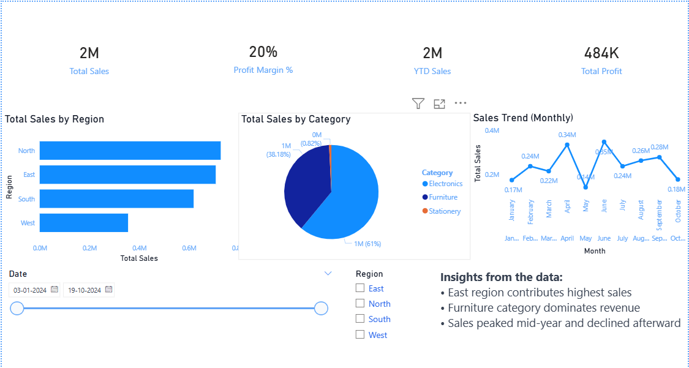

# 📊 Retail Sales Performance Dashboard — Power BI Project


---

## 📌 Overview

This project presents an interactive Power BI dashboard to analyze retail sales performance across regions and product categories.

The goal is to convert raw sales data into **clear business insights** using visualizations and DAX.

---

## 🖼️ Dashboard Preview



---

## 💼 Business Problem

A retail company operating across **4 regions (North, South, East, West)** needed a simple way to:

* Identify top-performing regions
* Track monthly sales trends
* Understand category-wise contribution
* Monitor overall profitability

Instead of manual Excel analysis, this dashboard provides **quick and interactive insights**.

---

## 🎯 Key Features

* KPI Cards → Total Sales, Profit, Profit Margin
* Sales trend (monthly)
* Region-wise comparison
* Category-wise distribution
* Interactive slicers (Region + Date)
* Insights panel for quick understanding

---

## 📂 Dataset

* ~100 rows of retail transactions
* Time period: Jan–Oct 2024
* Columns: Date, Region, Category, Sales, Profit

---

## 📊 Key Insights

* East region generates the highest revenue
* Electronics contributes the majority of sales
* Sales peaked mid-year and dropped afterward
* Profit margin remains stable around 20%

---

## 🧮 DAX Measures Used

```dax
Total Sales = SUM(retail_sales_data[Sales])
Total Profit = SUM(retail_sales_data[Profit])
Profit Margin % = DIVIDE([Total Profit], [Total Sales], 0)
```

```dax
MoM Growth % =
DIVIDE(
    [Total Sales] - CALCULATE([Total Sales], DATEADD(retail_sales_data[Date], -1, MONTH)),
    CALCULATE([Total Sales], DATEADD(retail_sales_data[Date], -1, MONTH))
)
```

---

## 🛠️ Tech Stack

* Power BI Desktop
* DAX
* Excel (CSV dataset)

---

## ▶️ How to Use

1. Download the `.pbix` file
2. Open in Power BI Desktop
3. Use slicers to interact with dashboard

---

## 📁 Project Structure

```
powerbi-retail-dashboard/
│
├── retail_sales_data.csv
├── retail_dashboard.pbix
├── dashboard_screenshot.png
└── README.md
```

---

## 👤 Author

**Akshay Yadav**

📧 [akshayyadav12356@gmail.com](mailto:akshayyadav12356@gmail.com)
🔗 https://github.com/Akshay448591
🔗 https://www.linkedin.com/in/akshay-yadav-53211727a

---

⭐ If you found this useful, feel free to star the repo!
